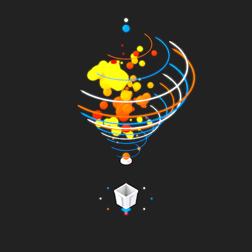

  
   
  
   
 

<!-- Simple Side-by-Side Layout -->

  <table style="border-collapse: collapse; margin: 20px auto; background: linear-gradient(135deg, #0D1117, #1a1a2e); border-radius: 20px; overflow: hidden; box-shadow: 0 0 40px rgba(0, 255, 65, 0.3);">
    <tr>
      <td style="padding: 30px; vertical-align: middle;">
        <h2 style="color: #00FF41; font-family: 'Courier New', monospace; font-size: 19px; text-shadow: 0 0 10px #00FF41; margin: 8px 0;">
          ◢◣◥◤◢◣ FULL-STACK WEB/APP DEVELOPER ◢◣◥◤◢◣
        </h2>
        <h3 style="color: #00D4AA; font-family: 'Courier New', monospace; font-size: 18px; text-shadow: 0 0 8px #00D4AA; margin: 8px 0;">
          ◥◤◢◣◥◤ React | Node.js | Python Expert ◥◤◢◣◥◤
        </h3>
        <h3 style="color: #FF6EC7; font-family: 'Courier New', monospace; font-size: 18px; text-shadow: 0 0 8px #FF6EC7; margin: 8px 0;">
          ◢◣◥◤◢◣ Cloud Architect & Data Analyst ◢◣◥◤◢◣
        </h3>
        <h3 style="color: #FFD700; font-family: 'Courier New', monospace; font-size: 18px; text-shadow: 0 0 8px #FFD700; margin: 8px 0;">
          ◥◤◢◣◥◤ Building Scalable Applications ◥◤◢◣◥◤
        </h3>
        <h3 style="color: #DC143C; font-family: 'Courier New', monospace; font-size: 18px; text-shadow: 0 0 8px #DC143C; margin: 8px 0;">
          ◢◣◥◤◢◣ SQL Insights & Performance Optimization ◢◣◥◤◢◣
        </h3>
      </td>
      <td style="padding: 20px; vertical-align: middle; background: radial-gradient(circle, rgba(0, 255, 65, 0.1), transparent);">
        
      </td>
    </tr>
  </table>

<!-- Snake Animation - TOP ONLY -->

  

<!-- Profile Counters with Neon Effect -->

  
  
  
  

---

## 🛠️ **Tech Arsenal - Weapons of Creation**

| **Tech Skills** |      |
|:---:|:---:|
| **🎯 Frontend Mastery**   **⚡ Backend & Cloud Power**   **🔧 Development Arsenal**   **💻 Programming Languages**  |  |

---

  

<!-- Animated Connector Lines -->

  

<!-- Social Links with GIF Side by Side -->

  <table style="border-collapse: collapse; margin: 20px auto;">
    <tr>
      <td style="padding: 20px; vertical-align: middle;">
        <!-- Party Animation GIF -->
        
      </td>
      <td style="padding: 20px; vertical-align: middle;">
        <!-- Social Links Table -->
        <table style="border-collapse: collapse;">
          <tr>
            <td style="padding: 8px;">
              
            </td>
            <td style="padding: 8px;">
              
            </td>
          </tr>
          <tr>
            <td style="padding: 8px;">
              
            </td>
            <td style="padding: 8px;">
              
            </td>
          </tr>
          <tr>
            <td colspan="2" style="padding: 8px; text-align: center;">
              
            </td>
          </tr>
        </table>
      </td>
    </tr>
  </table>

<!-- Call to Action -->

  

<!-- Decorative Footer -->

  

---

## 💭 **Daily Developer Wisdom**

  

## 🎯 **Fun Facts About Me**

🎮 <strong>Personal Interests & Digital Life</strong>

- 🌍 **Location:** Cardiff, Wales - Love the Welsh countryside and tech scene!
- ☕ **Coding Fuel:** Coffee enthusiast - peak performance at 2 AM
- 🎵 **Coding Soundtrack:** Lo-fi hip hop and synthwave while building apps
- 📚 **Learning Philosophy:** Hands-on project building > theoretical learning
- 🎯 **2025 Mission:** Master AI/ML integration in scalable web applications
- 🤝 **Open Source:** Always excited about collaborative development
- ⚖️ **Work-Life Balance:** Sustainable development practices advocate
- 🎨 **Design Aesthetic:** Clean code is beautiful code
- 🚀 **Innovation Mindset:** "Why follow when you can lead the tech evolution?"

---

<!-- Winter Themed Sign Off -->

  

